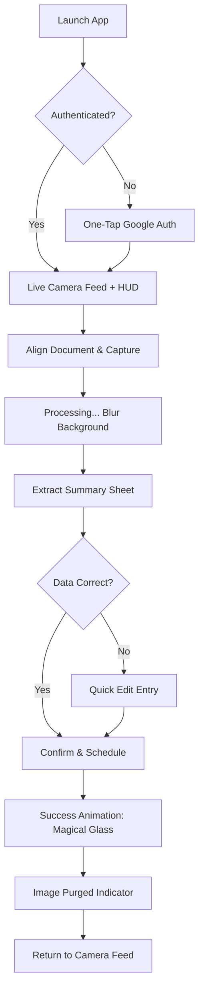
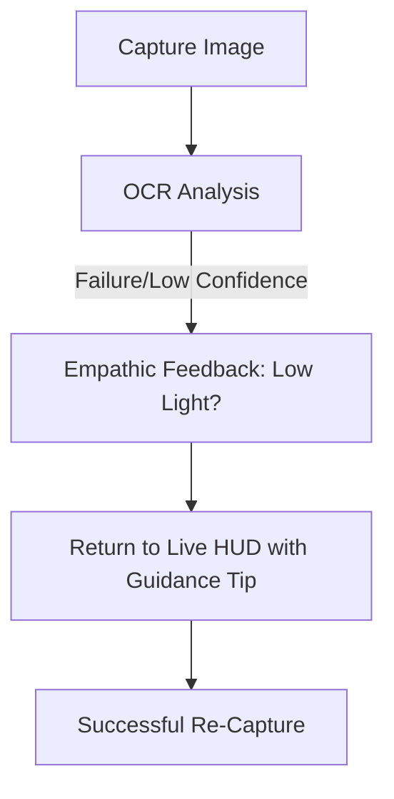

# UX Design Specification DocBot

**Author:** Labaile
**Date:** 2026-01-29

---

<!-- UX design content will be appended sequentially through collaborative workflow steps -->

## Executive Summary

### Project Vision

**DocBot** is a minimalist, privacy-first web utility that automates the transition from physical mail to digital calendar events. It aims to eliminate "due date anxiety" by providing a high-speed, zero-retention bridge between a mobile camera and Google Calendar.

### Target Users

*   **Busy Homeowners/Renters:** Managing household bills and time-sensitive notices.
*   **Privacy Advocates:** Users who demand zero data retention for sensitive financial documents.
*   **Efficiency-Seekers:** Mobile-first users who want to "snap and forget" their administrative chores.

### Key Design Challenges

*   **Trust & Verifiability:** Providing immediate, clear confirmation that a calendar event was created since the source image is deleted.
*   **Frictionless Authentication:** Integrating Google OAuth in a way that feels secondary to the primary "Capture" action.
*   **Edge Case Handling:** Designing graceful recovery for blurry photos or non-standard bill layouts without exhausting the user.

### Design Opportunities

*   **The "Snap-to-Finish" Flow:** Creating a single-purpose interface that feels more like a hardware tool than a software application.
*   **Magical Feedback:** Using premium animations/haptics to celebrate the conversion of "Paper Junk" into a "Digital Action."

## Core User Experience

### Defining Experience

The core experience of **DocBot** is the high-stakes transition from physical entropy (a pile of mail) to digital order (a calendar event). The central interaction is a seamless, one-handed capture and verification loop that prioritizes speed and security.

### Platform Strategy

*   **Platform:** Mobile-first Web Application.
*   **Interaction Model:** Touch-intensive. Large hit areas for one-handed operation while holding physical documents.
*   **Key Capabilities:** High-performance browser Camera API and encrypted OAuth cookie management for Google Services.

### Effortless Interactions

*   **Snap-and-Detect:** Automatic OCR triggering the moment a photo is confirmed, with zero manual input required for basic fields (Date, Amount).
*   **One-Tap Handoff:** Creating the Google Calendar event with a single, prominent confirmation action.
*   **Transparent Deletion:** Automatic visual feedback that "Image Data is Cleared" upon successful processing.

### Critical Success Moments

*   **The "Accuracy Reveal":** The moment the app correctly identifies a due date from a messy bill, creating instant user trust.
*   **The "Sync Celebration":** Clear, rewarding visual confirmation that the event now exists in the user's Google Calendar.
*   **Graceful Recovery:** A fast, low-friction "Retry" flow when environmental conditions (lighting, blur) cause OCR failure.

### Experience Principles

*   **Immediate Utility:** Every screen must move the user closer to the "Calendar Handoff" with zero distractions or dashboards.
*   **Trusted Transparency:** Proactive confirmation of data deletion to satisfy the privacy promise.
*   **Physicality in Digital:** Using depth, shadows, and haptic-like animations to make the capture feel like using a precision tool.

## Desired Emotional Response

### Primary Emotional Goals

The primary emotional goal for **DocBot** is **Calm Control**. We want to transform the minor background stress of receiving physical mail into a feeling of "Instant Delegation."

### Emotional Journey Mapping

*   **Initial Discovery:** *Curiosity* — "Can I really just snap this and be done?"
*   **The Capture Action:** *Satisfying Precision* — The GUI should make centering and snapping the document feel intentional and high-quality.
*   **The Processing Gap:** *Expectancy* — A calm, steady progress indicator builds anticipation without causing anxiety.
*   **The Result Reveal:** *Delight / Relief* — The "Aha!" moment when the app accurately reflects the bill's data.
*   **The Completion:** *Closure* — The feeling that the physical paper is no longer needed and can be safely discarded.

### Micro-Emotions

*   **Trust:** Reinforced by transparent "Data Cleared" notifications.
*   **Competence:** The user feels like they are using a "Pro Tool" rather than a clumsy utility.
*   **Empathy:** Graceful handling of OCR failures that centers the user's effort ("Let's try one more snap in better light").

### Design Implications

*   **Trust** → Professional, polished UI with clean lines and "Success" greens.
*   **Relief** → Prominent, celebratory confirmation of the Google Calendar sync.
*   **Control** → Every extracted field must be easily manually editable before final confirmation.

### Emotional Design Principles

*   **"Antidote to Paperwork":** The UI should be the opposite of the stressful bill it is scanning—clean, airy, and organized.
*   **"The Competent Assistant":** The app should behave like a specialized helper that takes the load off the user, not a form they have to fill out.

## UX Pattern Analysis & Inspiration

### Inspiring Products Analysis

*   **Google Lens:** Masterful "Physical-to-Digital" handoff with real-time bounding boxes that create a sense of intelligence and precision.
*   **Revolut (Check Deposit):** Uses corrective overlays and high-contrast guidance to ensure the hardware (camera) succeeded before the software (OCR) even starts.
*   **Uber (Live Activities):** Keeps the user informed during "Wait States" with dynamic, alive-feeling progress indicators that reduce perceived latency.

### Transferable UX Patterns

*   **Zero-Navigation Home:** Borrowing from the Camera app pattern where the capture interface is the primary entry point, eliminating traditional "Menu" friction.
*   **Guidance Overlays:** Implementing a "Document Frame" that changes color/state when a clear document is detected, mirroring the banking app "Deposit" experience.
*   **Haptic & Visual Pings:** Using physical feedback (vibration) and meaningful animations to celebrate the successful sync to Google Calendar.

### Anti-Patterns to Avoid

*   **onboarding wall:** Avoid forcing the user through a tour before they can perform their first "Snap."
*   **Silent Wait States:** Never leave the user on a blank screen while the OCR processes; the UI must indicate active work.
*   **Dashboard Bloat:** Resist adding "History" or "Settings" to the main view, which contradicts the "Zero-Retention" minimalist goal.

### Design Inspiration Strategy

*   **Adopt:** The "Guidance Frame" pattern to maximize OCR accuracy on the first try.
*   **Adapt:** Success animations that lend a "Magical" feel to the mundane task of bill management.
*   **Avoid:** Traditional web forms—DocBot should feel like a dedicated hardware tool.

## Design System Foundation

### Design System Choice

**Tailwind CSS + Headless UI / Radix UI.** 
Leveraging the speed and utility-first nature of Tailwind CSS, paired with unstyled accessible primitives for complex interactions (Camera overlays, Modals).

### Rationale for Selection

- **Architecture Alignment:** Directly supports the architectural decision to use Tailwind CSS within the Next.js 16 stack.
- **Visual Uniqueness:** Allows for a "Custom Tool" aesthetic that distinguishes DocBot from generic SaaS applications.
- **Mobile Performance:** Minimizes bundle size while providing the flexibility needed for responsive camera interfaces.

### Implementation Approach

- **Atomic Styling:** Using Tailwind utility classes for 100% of the UI.
- **Headless Transitions:** Utilizing Radix UI for its robustness in handling mobile touch-states and portal-based overlays.

### Customization Strategy

- **Tokens:** High-contrast "Action" colors (e.g., Electric Blue or Vibrant Green) for primary capture triggers.
- **Glassmorphism:** Substrate-level overlays using `backdrop-blur` to give the Camera GUI a high-end, futuristic feel.
- **Typography:** Implementation of **Geist Sans/Mono** for a technical, modern look.

## 2. Core User Experience

### 2.1 Defining Experience

The defining experience of **DocBot** is **"Snap and Delegate."** It is the magical moment where a chaotic piece of physical mail is instantly transformed into a structured digital action. The value is not in the photo itself, but in the immediate extraction of intentionality (When is this due? How much is it?).

### 2.2 User Mental Model

*   **Current State:** Administrative dread. Mail is a "chore" that requires manual data entry into a calendar.
*   **DocBot State:** Precise Automation. The user treats the app like a specialized scanner or a barcode reader—point, click, and trust the machine to handle the "thinking."
*   **Privacy Model:** Users expect a "Vanish" behavior. The mental model is that the app acts as a lens, not a storage locker.

### 2.3 Success Criteria

*   **First-Time Accuracy:** Correct identification of Due Date and Amount on the first capture (>90% confidence).
*   **Perceived Speed:** The transition from "Snap" to "Data Summary" must feel sub-3-second.
*   **Trust Handoff:** The user must feel 100% confident that the data is on their calendar and off the DocBot server.

### 2.4 Novel UX Patterns

*   **"Live-Detection" Overlays:** Borrowing from QR scanners to provide real-time feedback that the document is "in focus" before the user even clicks the shutter.
*   **"Ephemeral Success":** A novel animation pattern where the document "dissolves" or "uploads and vanishes" to visually reinforce the zero-retention policy.

### 2.5 Experience Mechanics

1.  **Initiation:** Direct entry into a full-screen Camera View upon app launch (if authenticated).
2.  **Interaction:** A "Capture" trigger with haptic feedback. Visual bounding boxes that snap to document edges.
3.  **Feedback:** A sliding bottom-sheet reveals the extracted `Vendor`, `Due Date`, and `Amount` while the image is blurred in the background.
4.  **Completion:** A single "Confirm & Schedule" action followed by a "Success" toast and a visual "Image Purged" indicator.

## Visual Design Foundation

### Color System

The visual identity of **DocBot** uses a **"Digital Lens"** theme, prioritizing high-contrast legibility and a professional "Pro-Tool" aesthetic.

*   **Primary (Action):** `Electric Emerald (#10B981)` — Used for the central "Capture" trigger and successful handoff actions.
*   **Background (Surface):** `Deep Slate (#0F172A)` — A dark-mode default to reduce glare and make the document (white paper) the clear focal point.
*   **Foreground (Text):** `Ghost White (#F8FAFC)` — For maximum accessibility on dark backgrounds.
*   **Semantic Colors:**
    *   **Success:** Vibrant Green (Handoff Complete).
    *   **Warning:** Amber (Blur/Low light detection).
    *   **Info:** Cyber Blue (Data extraction in progress).

### Typography System

*   **Primary Typeface:** **Geist Sans** — A modern, geometric grotesque that feels technical and clean.
*   **Secondary Typeface:** **Geist Mono** — Reserved for numerical data extraction (Dates, Currency, Confidence Scores) to reinforce the "precision computing" mental model.
*   **Scale:**
    *   **Headings:** `text-2xl` bold for primary actions.
    *   **Body:** `text-base` for descriptions.
    *   **Metadata:** `text-xs mono` for the "Data Purged" timestamps.

### Spacing & Layout Foundation

*   **Grid:** 8px base unit (Tailwind default).
*   **Density:** **Airy.** Layouts are designed to be "Thumb-friendly" with generous gutters to prevent fat-fingering during one-handed use.
*   **Corner Radius:** `rounded-2xl` (16px) for cards and modals to balance the technical aesthetic with approachable, soft edges.

### Accessibility Considerations

*   **Contrast:** Every color pairing must exceed WCAG 2.1 AA standards for legibility.
*   **Touch Targets:** All interactive elements (buttons, inputs) maintain a minimum hit area of 44x44px.
*   **Haptics:** Using the `vibrate` API (where supported) to provide tactile confirmation for users with visual impairments.

## Design Direction Decision

### Design Directions Explored

Four primary directions were explored:
1. **Viewfinder (HUD):** An AR-style interface where data floats transparently over the camera feed.
2. **Sliding Terminal:** A technical, terminal-style readout emphasizing the data processing stream.
3. **Magical Glass:** A minimalist, aesthetic-focused approach using blurred depth and celebratory animations.
4. **Precision Grid:** A utilitarian alignment tool focused on maximizing OCR success rates.

### Chosen Direction

**Hybrid: "The Professional Lens"**
A combination of the **Viewfinder (HUD)** for the live-interaction phase and the **Magical Glass** for the processing and completion states.

### Design Rationale

- **High-Stakes Trust:** The HUD elements (Direction 1) provide immediate feedback that the machine is "working" and "precise," which is critical for OCR tools.
- **Emotional Closure:** The transition to Direction 3 (Magical Glass) provides the calmness and emotional reward needed to transition the user from a "Chore" state to a "Done" state.
- **Tool Aesthetic:** This hybrid approach reinforces DocBot as a specialized tool rather than a generic web form.

### Implementation Approach

- **HUD Overlays:** Built with Tailwind absolute positioning and SVG "viewfinder" corners.
- **State Transition:** Use Framer Motion (already in our Next.js stack) to smoothly transition from the active camera view to the success sheet.
- **Color Usage:** Electric Emerald as the primary "Action" indicator against the Deep Slate background.

## User Journey Flows

### 1. The "Snap & Schedule" Journey (Core Flow)

The primary interaction cycle where a user converts physical mail into a digital event.

### 2. The "Retry" Journey (Error Recovery)

A graceful fallback for when environmental conditions prevent successful OCR.

### Journey Patterns

*   **Camera-First Entry:** The app always defaults to the viewfinder to minimize time-to-value.
*   **Bottom-Weighted Interaction:** All primary triggers are positioned in the "thumb zone" for one-handed document management.
*   **Transparent Processing:** Background blurring during OCR provides a clear visual metaphor for "Active Analysis."

### Flow Optimization Principles

*   **Minimized Pockets:** No nested navigation or dashboards. Every journey begins and ends at the lens.
*   **Stateful Visual Contrast:** Using technical HUD elements for "work" states and soft glassmorphism for "success" states to signal chore completion.
*   **Proactive Deletion:** Visually confirming the "Image Purged" status as an integral step in the completion flow to build trust.

## Component Strategy

### Design System Components

**Available from Foundation (Radix + Tailwind):**
*   **Buttons:** Action triggers for "Confirm" and "Schedule."
*   **Modals/Dialogs:** For Google OAuth and Error alerts.
*   **Toasts:** Success and failure notifications.
*   **Input Fields:** For manual data correction (Due Date, Amount).

### Custom Components

#### `LiveViewfinder`
*   **Purpose:** Guide the user to align the document for 100% OCR success.
*   **Usage:** Primary interaction screen during capture.
*   **Anatomy:** Camera feed background, HUD line overlays, real-time bounding box.
*   **States:** `Searching` (White outline), `Locked` (Emerald green + Haptic), `Capturing` (Brief flash).
*   **Accessibility:** ARIA live region for "Document Detected" status.

#### `DataRevealSheet`
*   **Purpose:** Present extracted data clearly for verification.
*   **Usage:** Slides up after OCR completes.
*   **Anatomy:** `Vendor Badge`, `Mono Date Field`, `Mono Amount Field`, `Confirm Button`.
*   **Interaction Behavior:** Swipe down to dismiss (retry), Tap fields to edit.

#### `EphemeralIndicator`
*   **Purpose:** Reinforce the privacy promise.
*   **Usage:** Persistent micro-status on the bottom of the viewfinder.
*   **Anatomy:** Shield icon + "Privacy Lock: Zero-Retention Active".

### Component Implementation Strategy
- Build custom components using Tailwind utility classes and Framer Motion.
- Use Radix UI primitives for accessible dialogue and sheet behaviors.
- Ensure all custom components follow the "Professional Lens" visual foundation (dark mode, Geist fonts).

### Implementation Roadmap
**Phase 1 - Core:**
*   `LiveViewfinder` (Critical for the "Snap" experience).
*   `One-Tap Auth Modal`.
*   `DataRevealSheet` (The reveal moment).

**Phase 2 - Supporting:**
*   `SuccessOverlay` (Magical closure).
*   **RetryGUIDE:** (Empathetic error states).

## UX Consistency Patterns

### Button Hierarchy

*   **Primary (Action):** `bg-emerald-500` - Used for "Capture" and "Schedule." These should be large and centrally located in the thumb zone.
*   **Secondary (Adjust):** `variant: ghost` - Used for "Edit" or "Skip" actions that are secondary to the main flow.
*   **Negative/System:** `variant: outline` - Used for "Cancel" or "Clear Data" actions.

### Feedback Patterns

*   **Success:** A celebratory "Magical Glass" overlay with a haptic thump and emerald checkmark.
*   **Error (Soft):** Amber-colored HUD rings with a tip: "Too dark? Try moving closer."
*   **Error (Hard):** Red-tinted HUD with a clear "Retry" action button.
*   **Wait State:** An active vertical "Scanline" animation synchronized with a "Processing..." mono-status message.

### Form Patterns

*   **Data-Driven Drafts:** We never show empty forms. Result sheets are pre-populated by OCR.
*   **In-Place Editing:** Tapping any data point (Amount, Date) converts it into a focused input field with an auto-saved state.

### Navigation Patterns

*   **Single-Axis Experience:** The app moves exclusively on the vertical axis (Camera -> Reveal Sheet -> Success).
*   **Gestural Dismissal:** Sheets can be swiped down to return to the active camera.

### Additional Patterns

*   **Haptic Pulse:** Using short haptic feedback during document "Lock" and "Completion" to reinforce physical tool feel.
*   **Live-Status:** A corner HUD element showing "Google Sync: Active/Inactive" to maintain system transparency.

## Responsive Design & Accessibility

### Responsive Strategy

**DocBot** is a "Utility-First" application with a **Mobile-Only Core** philosophy.

*   **Mobile-First Interaction:** The interface is 100% optimized for vertical, one-handed operation.
*   **Desktop/Tablet Adaptation:** On larger screens, the application is presented as a fixed-width "Utility Card" (max-width: 480px) centered against a high-end ambient blurred background. This maintains the "Hardware Tool" mental model across all devices.

### Breakpoint Strategy

*   **Compact (< 360px):** HUD padding is reduced, and typography scales down 10% to ensure the camera viewfinder remains the primary focus.
*   **Mobile Base (360px - 480px):** The standard "thumb-zone" layout applies.
*   **Tablet/Desktop (> 480px):** The layout locks to 480px to prevent the camera interface from becoming unwieldy or distorted.

### Accessibility Strategy (WCAG 2.1 AA Compliance)

*   **Color Contrast:** Primary color pairings (`Emerald` on `Deep Slate`) maintain a minimum 7:1 ratio, exceeding standard requirements to ensure usability in variable lighting.
*   **Touch Targets:** All primary interaction points (Capture, Confirm) are guaranteed a minimum hit area of 48x48px.
*   **Screen Reader Support:** The HUD elements utilize `aria-live` regions to announce document detection status and successful OCR extraction.
*   **Haptic Reinforcement:** Tactile feedback is integrated as a core accessible feature, providing "Success/Failure" pulses for users with visual impairments.

### Testing Strategy

*   **Environment Testing:** Validating UI legibility in extreme lighting conditions (high glare/low light).
*   **One-Handed Stress Test:** Verification that the "Confirm & Schedule" loop can be completed without adjusting grip on standard-sized mobile devices.
*   **Assistive Tech:** Testing with iOS VoiceOver and Android TalkBack to ensure the "Camera Feed" logic remains navigable.

### Implementation Guidelines

- Use relative units (`rem`, `vh`) to ensure the bottom-sheet reveal works consistently across varying device heights.
- Prioritize semantic HTML (`<main>`, `<section>`, `<header>`) to provide a structured map for assistive technologies.
- Utilize CSS `env(safe-area-inset-bottom)` to prevent interaction overlap with system home bars.
